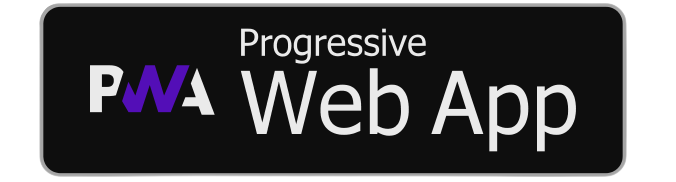

<h1 align="center"> NearBuy </h1>
<h3 align="center">
    We deliver the store to your door.
</h3>

    

    
    
    

## Table of Contents

- [Introduction](#introduction)
- [Features](#features)
- [Program Structure](#program-structure)
- [Progressive Web Application](#progressive-web-application)
- [Developers](#developers)

## Introduction

    Near Buy is an online grocery delivery service, developed by a group of young Filipino millennials, that aims to ensure fast, convenient, and safe delivery of groceries right at your doorstep.

    With more people stuck at home due to the Covid-19 outbreak, there has been a surge in demand for food delivery services. Hevenn Fuerte and Rondel Hallare responded to the crisis by introducing contactless delivery options to eliminate the risk of spreading the virus while providing its customer's needs.

## Features

    A few of the things you can do with NearBuy:

* Check the products available 
* Sort the products based on type 
* Add a product to their cart 
    + Proceed to <a href="https://near-buy.netlify.app/categories">Categories</a> to check the functionalities.
* Increase the amount of one particular product in their cart 
* Decrease the amount of one particular product in their cart 
* Remove one particular product in their cart 
* Remove all product in their cart 
* Checkout and finalize the products in their cart for ordering 
    + Proceed to <a href="https://near-buy.netlify.app/cart">Cart</a> to check the functionalities.
* Check the status of their order number 
    + Proceed to <a href="https://near-buy.netlify.app/track">Track</a> to check the functionality.
* Communicate with the NearBuy Owners using the Messenger plugin 
    + Proceed to <a href="https://near-buy.netlify.app/">Home</a> to check the functionality.
* Communicate with the NearBuy Owners using the FormSpree plugin 
    + Proceed to <a href="https://near-buy.netlify.app/contact-us">Contact Us</a> to check the functionality.

## Program Structure
<h4> UML </h4>

    

<h4> ERD </h4>

    

## Progressive Web Application
Requirements:

- Broswer (Google Chrome, FireFox, and Safari)
- Internet connection
- Allow browser to write and store web files locally

    To access the NearBuy Progressive Web Application the end-users must have a browser to store and access the NearBuy deployment site, upon loading the home page or landing page a pop-up would appear ask the end-user whether to accept or decline the installation of the NearBuy PWA to their phone, desktop, laptop or any device. Once installation is done a button or icon would be created in the device's home screen or app list. Please follow the video for a clearer guide:

    

## Developers

    
    
    
    
    
    

